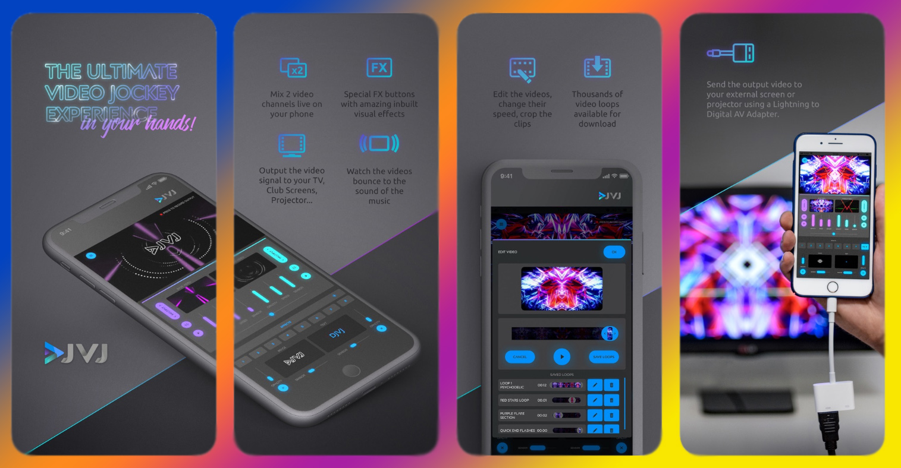

# DJVJ
> A Video Mixing app can overlay and blend video.

## Description

Become a professional video jockey with this VJ app, mixing up to 5 visual layers at once: two video channels, one image layer, one text layer and a special effects button-pad. Use this video jockey app to create amazing video loops and mix your videos like a pro everywhere, achieving an experience never seen before.

## Install

- AppStore (recommend)

  > [**DJVJ** https://apps.apple.com/us/app/djvj/id1446550854](https://apps.apple.com/us/app/djvj/id1446550854)

## Capability

- Mix visuals that bounce to the music! Your device’s microphone is used as a sensor to make your mix react to the music. Each channel has it’s own sensor slider so you can choose how sensitive it is to the audio input. Watch your creations jump to the beat in real time!

- VJ loops creator: use the 2 Video Mixing Channels to create spectacular visuals.

- Create spectacular visuals using the Base Video Layer Styles and the Overlay Video Blend Modes, which you can combine to make hundreds of different visual effects. Each Blend Mode affects how the Base Video beneath looks. You can alter many parametres, such as hue, color, saturation and much more to give your videos those PRO effects your party needs to be the best.

- Select up to 7 different Special Effects which can be loaded into the Effects Button Pad. The Special Effects happen above all other layers. The VJ can press and hold a Special Effects Button and this visual will happen while the button is being pressed. Upon release (mouse out), the effect stops. By default there will be 7 Effects pre-assigned, but by pressing the FX+ Button, these can be changed in the Select Effects Window.

— 2 video mixing channels —

The two video channels have slider controls that allow the VJ to control the speed, opacity and sensitivity of each video loop, as well as assigning a blend mode and a layer style which customises their visuals. You can also edit and save cropped versions of any of the video loops so that you build up your own library of loops to mix with. The app launches with over 30 exclusive video loops included for free, and features a Video Shop that will give users the ability to browse and purchase new material from an extensive library of Video Loop Packages. This way, you can build a custom video library to suit your own style and needs.

— 1 image layer —

The image layer comes with 6 free image packages containing over 100 images which can be mixed into the output video. You can adjust the size, opacity and sensitivity of your chosen image, which will appear above the video layers. If you want to add any other image packs for a specifically themed event, just visit the Image Shop!

— 1 text layer —

In DJVJ you can write any desired custom text to output to your festival screens. You can edit the size and colour of the text and select the font style amongst a selection cool typographies, and this layer too you can then control via its sensor and opacity sliders.

— 1 special effects button-pad —

DJVJ comes with 20 free special effects which become one of the coolest features when doing a live mix. You have a special effects button-pad on the main screen of the UI with 7 effect buttons, and you can choose which effect you want to load in each of them from the FX+ selection window. Just drag your desired effects over the container buttons, save your settings and enjoy! The effects are applied live to your entire output.

## Contact Information
hulala07@outlook.com

